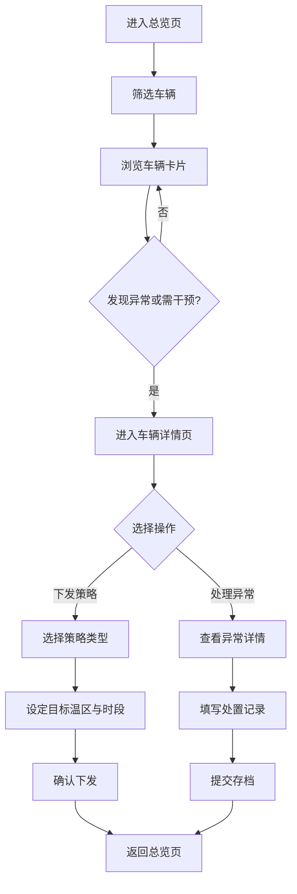

## 1. 产品概述

面向冷链运输企业调度主管的车队调度 Web 控制台，用于统一监控冷藏车辆油机、电机和车厢温度的联动运行状态，支持联控策略下发与异常处置全流程追溯。

- 解决冷链运输中温控、能耗、调度三者协同效率低的问题
- 目标用户：调度主管、车队运营人员

## 2. 核心功能

### 2.1 用户角色

| 角色 | 注册方式 | 核心权限 |
|------|---------|---------|
| 调度主管 | 系统内置账号 | 查看全部车辆、下发策略、处理异常、查看处置记录 |

### 2.2 功能模块

1. **总览页**：车辆筛选、车辆卡片列表、状态概览统计
2. **车辆详情页**：车辆实时数据、联控策略下发面板、历史策略记录
3. **异常处理页**：异常事件列表、异常处理单、处置记录追溯

### 2.3 页面详情

| 页面名称 | 模块名称 | 功能描述 |
|---------|---------|---------|
| 总览页 | 顶部筛选栏 | 按线路、货品类型、司机多维度筛选车辆 |
| 总览页 | 状态统计概览 | 在途/异常/离线车辆数量统计 |
| 总览页 | 车辆卡片网格 | 展示制冷来源、油量、电量、厢温、门磁、预计到仓时间 |
| 车辆详情页 | 实时状态面板 | 车辆详细信息、当前温度曲线、油机电状态 |
| 车辆详情页 | 策略下发面板 | 选择"优先省油/优先保温/到仓前预冷"策略、设定目标温区和生效时段 |
| 车辆详情页 | 策略历史记录 | 已下发策略的执行状态和时间线 |
| 异常处理页 | 异常事件列表 | 温度超上限、油机启动失败、电量不足等异常事件 |
| 异常处理页 | 处置处理单 | 备注沟通结果、改派补能点、要求停车检查 |
| 异常处理页 | 处置记录列表 | 所有异常处置的可追溯历史记录 |

## 3. 核心流程

调度员进入首页 → 按线路/货品/司机筛选车辆 → 查看车辆卡片状态 → 点击异常或需干预车辆 → 进入详情页查看实时数据 → 下发联控策略或处理异常 → 填写处置记录 → 提交存档。

## 4. 用户界面设计

### 4.1 设计风格

- **主色调**：冷调深蓝 `#0F172A` 作为主背景，搭配冷链蓝 `#0EA5E9` 作为主色
- **辅助色**：警示红 `#EF4444`、警戒橙 `#F59E0B`、安全绿 `#10B981`
- **中性色**：Slate 灰阶系列，保证信息层次清晰
- **按钮风格**：扁平化圆角设计，高对比度强调操作
- **字体**：使用系统无衬线字体，数据数值采用等宽字体以增强可读性
- **布局风格**：左侧导航栏 + 顶部工具区 + 主体内容区的经典控制台布局
- **图标风格**：Lucide 线性图标，统一 1px 描边风格

### 4.2 页面设计概述

| 页面名称 | 模块名称 | UI 元素 |
|---------|---------|---------|
| 总览页 | 顶部筛选栏 | 下拉选择器、搜索框、重置按钮，冷灰背景配蓝色焦点态 |
| 总览页 | 状态统计概览 | 卡片式统计块，带趋势箭头和图标 |
| 总览页 | 车辆卡片网格 | 高密度信息卡片，圆角 8px，边框分隔，状态色边框标识异常 |
| 车辆详情页 | 实时状态面板 | 双栏布局：左侧关键指标卡片，右侧温度折线图 |
| 车辆详情页 | 策略下发面板 | 分段控制器选择策略类型，数字输入框设定参数，提交按钮 |
| 车辆详情页 | 策略历史记录 | 时间线式列表，状态标签区分执行中/已完成 |
| 异常处理页 | 异常事件列表 | 表格布局，异常级别色标记行，操作列按钮 |
| 异常处理页 | 处置处理单 | 右侧抽屉表单，文本域 + 单选按钮组 |
| 异常处理页 | 处置记录列表 | 可追溯历史表格，支持时间范围筛选 |

### 4.3 响应式

- 桌面端优先设计，适配 1440px 及以上分辨率
- 筛选栏在窄屏下自动换行
- 车辆卡片采用响应式网格，根据屏宽自动调整列数
- 侧边导航在移动端可折叠收起

