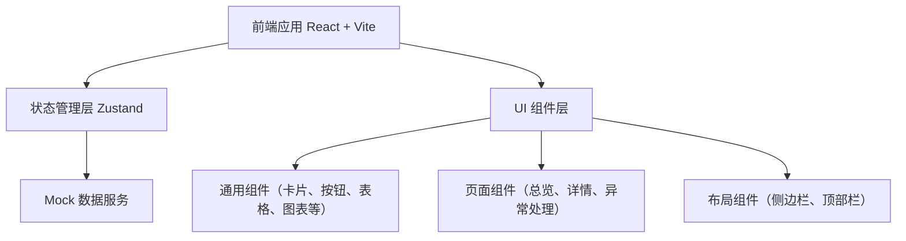
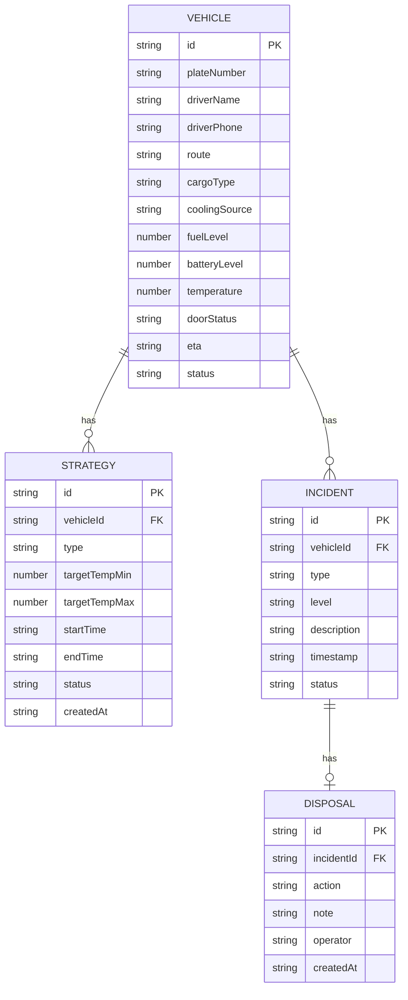

## 1. 架构设计



## 2. 技术说明

- 前端：React@18 + TypeScript + Vite@5
- 样式：TailwindCSS@3
- 状态管理：Zustand
- 路由：react-router-dom@6
- 图标：lucide-react
- 图表：纯 SVG 自绘简单折线图（无需额外图表库，保持轻量）
- 后端：无后端，前端纯 Mock 数据模拟
- 数据：本地 TypeScript Mock 数据 + Zustand 管理

## 3. 路由定义

| 路由 | 用途 |
|-----|------|
| / | 重定向到总览页 |
| /dashboard | 总览页 - 车辆卡片总览与筛选 |
| /vehicle/:id | 车辆详情页 - 实时状态与策略下发 |
| /incidents | 异常处理页 - 异常列表与处置记录 |

## 4. 数据模型

### 4.1 数据模型定义



### 4.2 核心类型定义

```typescript
type CoolingSource = 'engine' | 'battery' | 'hybrid' | 'off';
type DoorStatus = 'closed' | 'open' | 'unknown';
type VehicleStatus = 'running' | 'idle' | 'warning' | 'error' | 'offline';
type StrategyType = 'fuel_save' | 'thermal_first' | 'precool_before_arrival';
type StrategyStatus = 'pending' | 'active' | 'completed' | 'failed';
type IncidentType = 'temp_high' | 'engine_fail' | 'battery_low' | 'door_open' | 'other';
type IncidentLevel = 'critical' | 'warning' | 'info';
type IncidentStatus = 'pending' | 'processing' | 'resolved';
type DisposalAction = 'call_driver' | 'reroute_station' | 'stop_and_check' | 'other';
```

## 5. 项目目录结构

```
src/
├── components/          # 通用组件
│   ├── Layout/         # 布局组件
│   │   ├── Sidebar.tsx
│   │   ├── Topbar.tsx
│   │   └── AppLayout.tsx
│   ├── Vehicle/        # 车辆相关组件
│   │   ├── VehicleCard.tsx
│   │   ├── VehicleFilter.tsx
│   │   └── VehicleStats.tsx
│   ├── Strategy/       # 策略相关组件
│   │   ├── StrategyForm.tsx
│   │   └── StrategyHistory.tsx
│   ├── Incident/       # 异常相关组件
│   │   ├── IncidentList.tsx
│   │   ├── IncidentDrawer.tsx
│   │   └── DisposalRecord.tsx
│   └── UI/             # 基础UI组件
│       ├── Badge.tsx
│       ├── Button.tsx
│       ├── StatusIndicator.tsx
│       └── TempChart.tsx
├── pages/              # 页面组件
│   ├── Dashboard.tsx
│   ├── VehicleDetail.tsx
│   └── Incidents.tsx
├── store/              # Zustand Store
│   └── fleetStore.ts
├── types/              # TypeScript 类型定义
│   └── index.ts
├── data/               # Mock 数据
│   └── mockData.ts
├── utils/              # 工具函数
│   └── formatters.ts
├── App.tsx
├── main.tsx
└── index.css
```
